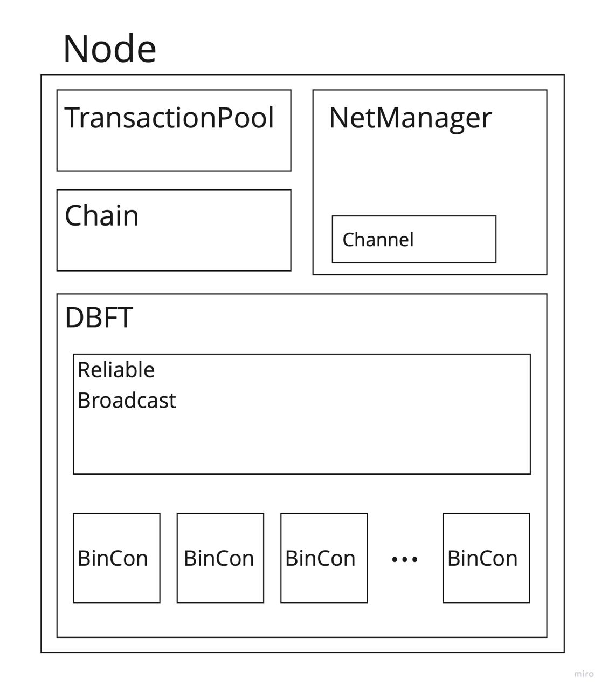

# Leaderless Blockchain Consensus

C++ реализация алгоритма блокчейн консенсуса без лидера Democratic Byzantine fault tolerance ([DBFT](https://ieeexplore.ieee.org/stamp/stamp.jsp?arnumber=8548057&casa_token=FliiGSKhyBoAAAAA:fedQg0QsQIzFc7Hei_2JXBUQNMQNx2d616sutm4eFippxKv44fyCEWsoKShclX-9sBMx9HIzHeOIYg&tag=1)). Было проведено экспериментальное сравнение их работы при различной доле злоумышленников с несколькими видами поведений:
- FailStop
- 2 модели Византийского поведения, описанные [здесь](#модель-поведения-византийских-участников)

## Содержание
* [Запуск](#запуск)
* [Модель симулятора](#модель-симулятора)
    * [Модель сети](#модель-сети)
* [Модель поведения Византийских участников](#модель-поведения-византийских-участников)


## Запуск
### Пререквизиты
- C++ 20
- Cmake 3.2
- Boost 1.74
- nlohmann_json 3.2.0
- GTest 1.13.0
- glog 0.6.0

Запуск тестов:
```sh
mkdir build
cd build
cmake -DCMAKE_BUILD_TYPE=RELEASE ..
make
ctest
```
Запуск экспериментов (из директории build):
```sh
./tests/run_simulation.cpp
```

## Модель симулятора
Есть $N$ заранее известных участников сети, $f$ из которых могут иметь византийское поведение, причем $N >= 3f + 1$.
Симуляция исполняется на одном компьютере, каждый участник однопоточный, и исполняется в своём потоке. Схема участника сети:
<p align="center">
    
</p>

Участники общаются с помощью сообщений через каналы. Подробно о различных видах каналов сети в симуляторе сказано [здесь](#модель-сети). Во время проведения экспериментов использовалась сеть TimerNetwork.

### Модель сети
Все участники сети заранее известны, они общаются с помощью сообщений через каналы. У каждого участника есть свой канал и ссылки на каналы всех других участников. Модель сети частично-синхронная, то есть у сообщений могут быть произвольные (но не бесконечные) неизвестные задержки.

В симуляторе есть несколько вариантов сети:
- **ManualNetwork**: Каналы между участниками здесь - потокобезопасные очереди сообщений. Сеть представляет собой отдельный поток со своей очередью сообщений, у участников также есть свои собственные очереди, из которых они берут пришедшие сообщения. При отправке сообщения участник добавляет его в очередь сети. Эту сеть можно исполнять пошагово, или можно перемешивать очередь. Использовалась для тестирования алгоритмов.

- **Network**: Каналы такие же, как и в предыдущем варианте сети. Отличие в отсутствии дополнительной очереди у сети, и отдельного потока для неё. Теперь при отправке участники добавляют своё сообщение напрямую в канал получателя. Сеть также использовалась для тестирования алгоритмов.

- **TimerNetwork**: Каналы между участниками здесь - планировщики из библиотеки Boost.Asio. Когда сообщение отправляется, в планировщик (который принадлежит получателю) добавляется таймер с случайной задержкой (из равномерного распределения) для этого конкретного сообщения. По истечению таймера выполняется функция, обрабатывающая это сообщение. Такая сеть использовалась непосредственно для экспериментов.

## Модель поведения Византийских участников
Были предложены 2 модели Византийского поведения. Цель этих поведений увеличить latency, за счёт увеличения числа раундов, необходимых для сходимости бинарного консенсуса.

- **Rejector**: cразу отправляет во все бинарные консенсусы все сообщения с значением 0 на всех этапах в достаточное число раундов, не дожидаясь чужих сообщений. Византийские координаторы также отсылают всем нули.
- **BinConCrasher**: сразу отправляет во все бинарные консенсусы все сообщения с обоими значениями (и 0, и 1) на всех этапах в достаточное число раундов, не дожидаясь чужих сообщений. Византийские координаторы отсылают каж- дому участнику случайное значение.
(TODO: подробное описание поведений)